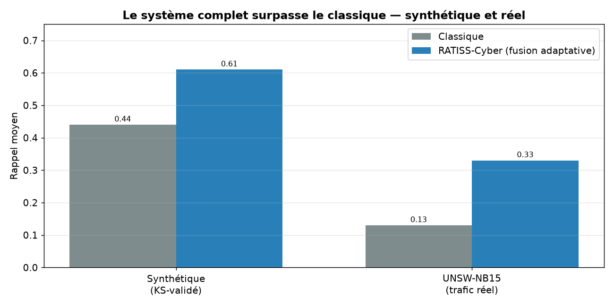
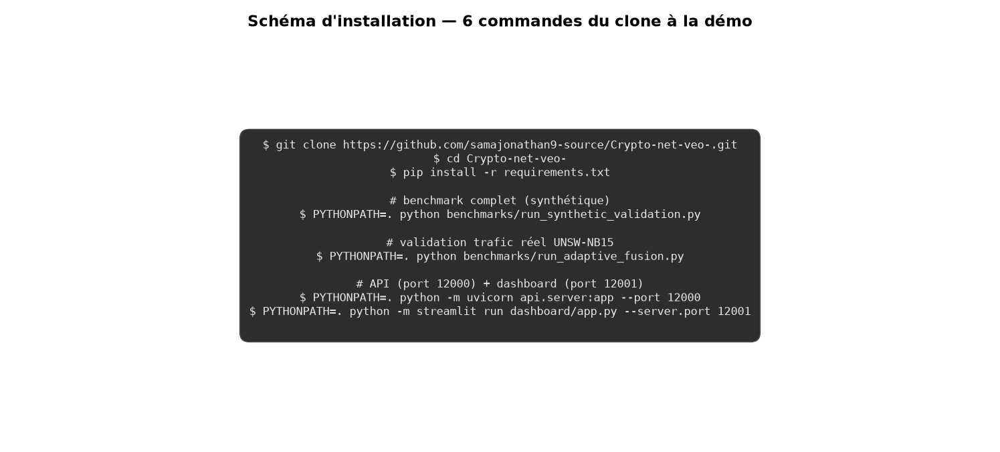
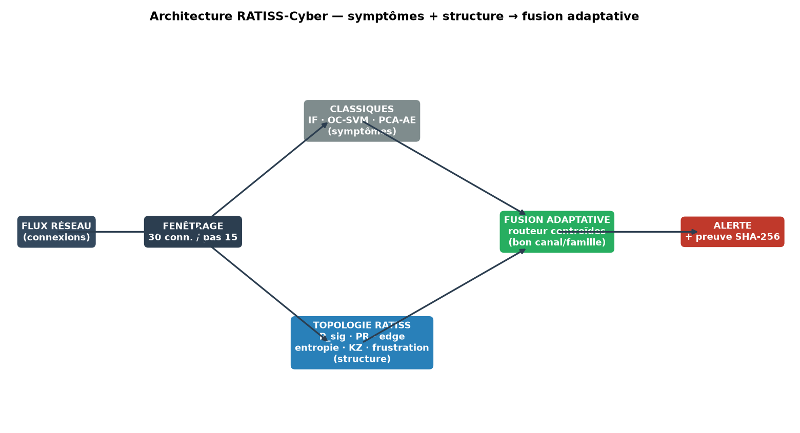
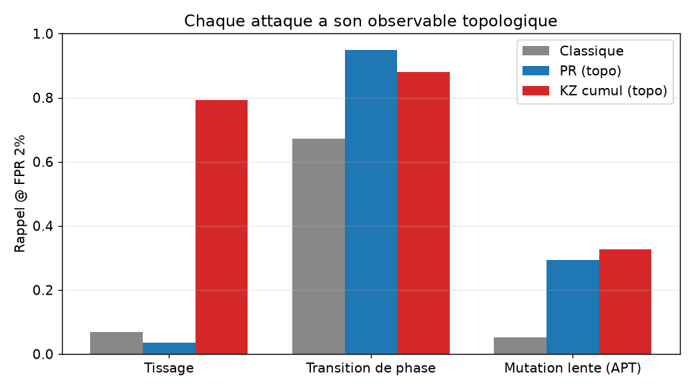
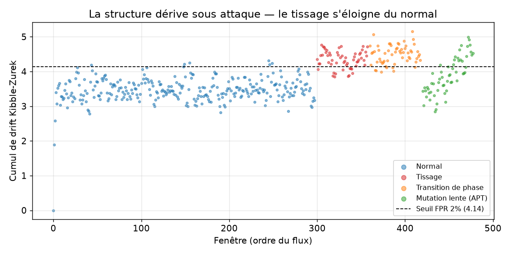

# 🛡️ RATISS-Cyber — Détection d'intrusion par topologie des transitions de phase

**POC RATISS Labs (Cameroun) — Jonathan Evina**
Prototype de NIDS couplant algorithmes classiques + arsenal topologique RATISS
(Vietoris-Rips, P_sig, Kibble-Zurek). Cible : démo SMI CybIA, Douala, nov. 2026.

> Les classiques voient les **symptômes**. RATISS voit la **structure**.
> La fusion adaptative choisit le bon canal — et chaque alerte est **prouvée** par SHA-256.



**Central : sur trafic réel (UNSW-NB15) et synthétique, la fusion adaptative surpasse le classique — atteint la borne oracle.**

## 🚀 Installation (schéma complet)

```bash
git clone https://github.com/samajonathan9-source/Crypto-net-veo-.git
cd Crypto-net-veo-
pip install -r requirements.txt

# benchmarks
PYTHONPATH=. python benchmarks/run_synthetic_validation.py   # synthétique
PYTHONPATH=. python benchmarks/run_adaptive_fusion.py       # UNSW réel

# API + dashboard
PYTHONPATH=. python -m uvicorn api.server:app --port 12000
PYTHONPATH=. python -m streamlit run dashboard/app.py --server.port 12001
```



## 🧠 Architecture

Flux réseau → fenêtrage → classiques (symptômes) + topologie RATISS (structure)
→ fusion adaptative (routeur centroïdes) → alerte + preuve SHA-256.



## 📊 Résultats (reproductibles)

### Synthétique contrôlé — avantage unique

Attaques conçues invisibles aux statistiques (tests KS ✅) :

- **PR** détecte la transition de phase : rappel **0.95** vs 0.67.
- **KZ cumul** détecte le tissage : rappel **0.79** vs 0.07.



### UNSW-NB15 — trafic réel

175k train / 87k test, 9 familles modernes :

| Famille | Classique | Meilleur RATISS |
|---|---|---|
| Generic | 0.02 | **KZ cumul 0.51** |
| Exploits | 0.17 | frustration |
| Fuzzers | 0.14 | edge |
| DoS | 0.07 | entropie |

### Fusion adaptative = plafond oracle

| Méthode | Rappel |
|---|---|
| Statique | 0.175 |
| **Adaptative (routeur)** | **0.339** |
| Oracle | 0.328 |

### Robustesse temporelle (CV 5-fold TimeSeriesSplit)

**0.342 ± 0.227** — robuste en moyenne, variable selon régime (documenté).
La détection de rupture + recalibration aide sur Fold 4 (+88%).



## 🗂️ Contenu

- `ratiss_topo/` — moteur topologique + arsenal (hystérésis, KZ, frustration, LCT)
- `cyber/` — classiques, fusion, fusion adaptative, régime, calibration
- `benchmarks/` — phases 1-5 + UNSW + adaptative + CV + dynamique
- `api/` — API FastAPI (9 canaux, preuve SHA-256, mémoire KZ)
- `dashboard/` — dashboard Streamlit temps réel (mode campagne)
- `datasets/UNSW-NB15/` — dataset (Git LFS)
- `docs/` — phases, figures, papier LaTeX/PDF

## 🗺️ Feuille de route

Phase 1 ✅ fondations → 2 ✅ couplage → 3 ✅ avantage unique → 4 ✅ arsenal →
5 ✅ fusion + figures → **SMI CybIA** : UNSW + adaptative + CV + rupture.

## 🙏 Citations

- UNSW-NB15 : https://research.unsw.edu.au/projects/unsw-nb15-dataset
- NSL-KDD : https://www.unb.ca/cic/datasets/nsl.html

_Construction par OpenHands sur le projet RATISS de Jonathan._
