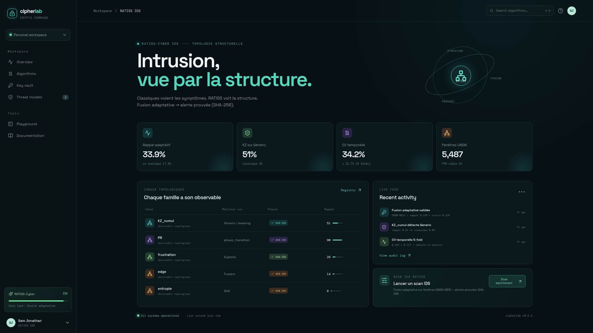

# RATISS-Cyber — Détection d'intrusion par topologie des transitions de phase

**POC RATISS Labs — Jonathan Evina.** Détection d'intrusion (NIDS) qui couple
les détecteurs classiques (symptômes) à l'arsenal topologique RATISS
(Vietoris-Rips, P_sig, Kibble-Zurek, frustration). Chaque alerte est **prouvée**
(SHA-256). Cible : SMI CybIA, Douala, novembre 2026.


Sur trafic **réel** (UNSW-NB15) comme sur synthétique KS-validé, la fusion
adaptative surpasse le classique — et atteint la **borne oracle**.

---

## ⬇️ Installation

```bash
git clone https://github.com/samajonathan9-source/Crypto-net-veo-.git
cd Crypto-net-veo-
pip install -r requirements.txt
```

### Reproduire les benchmarks

```bash
# Preuve sur attaques synthétiques (invisibles aux stats, tests KS)
PYTHONPATH=. python benchmarks/run_synthetic_validation.py

# Validation sur trafic réel UNSW-NB15 (175k/87k)
PYTHONPATH=. python benchmarks/run_unsw_validation.py

# Fusion adaptative (routeur à centroïdes) — borne oracle
PYTHONPATH=. python benchmarks/run_adaptive_fusion.py

# Robustesse temporelle (TimeSeriesSplit 5-fold)
PYTHONPATH=. python benchmarks/run_temporal_cv.py
```

### Interfaces

```bash
# API (port 12000)
PYTHONPATH=. python -m uvicorn api.server:app --port 12000

# Dashboard Streamlit (port 12001)
PYTHONPATH=. python -m streamlit run dashboard/app.py --server.port 12001

# Dashboard web React/Vite (optionnel, port 12003)
cd dashboard/web && npm install --legacy-peer-deps && npx vite preview --port 12003
```


---

## 🧠 Architecture

Flux réseau → fenêtrage → classiques (symptômes) + arsenal topologique RATISS
(structure) → fusion adaptative (routeur centroïdes) → alerte + preuve SHA-256.


---

## 📊 Résultats (reproductibles)

### Avantage unique — synthétique contrôlé

Attaques conçues **invisibles aux statistiques** (tests KS ✅) :

- **PR** détecte la transition de phase : rappel **0.95** vs 0.67.
- **KZ cumul** détecte le tissage : rappel **0.79** vs 0.07.


### Tráfic réel UNSW-NB15

175 341 train / 87 000 test, 9 familles modernes :

| Famille | Classique | Meilleur RATISS |
|---|---|---|
| Generic | 0.02 | **KZ cumul 0.51** |
| Exploits | 0.17 | frustration |
| Fuzzers | 0.14 | edge |
| DoS | 0.07 | entropie |

### Fusion adaptative ≈ borne oracle

| Méthode | Rappel |
|---|---|
| Statique | 0.175 |
| **Adaptative (routeur)** | **0.339** |
| Oracle | 0.328 |

### Robustesse temporelle (CV 5-fold)

**0.342 ± 0.227** — robuste en moyenne, variable selon régime (documentée).
La détection de rupture + recalibration aide sur le Fold 4 (+88%).


---

## 🖥️ Dashboard web (React/Vite)

Interface sombre premium avec les métriques réelles : 4 cartes (fusion adaptative,
KZ sur Generic, CV temporelle, fenêtres UNSW), table des canaux topologiques,
live feed, bouton de scan IDS. Construite avec shadcn/ui + Tailwind.



Voir `dashboard/web/README.md` pour le détail.

---

## 🧰 Contenu du dépôt

- `ratiss_topo/` — moteur topologique + arsenal (hystérésis, KZ, frustration, LCT)
- `cyber/` — classiques, fusion, fusion adaptative, régime, calibration
- `benchmarks/` — phases 1-5 + UNSW + adaptative + CV + dynamique
- `api/` — API FastAPI (9 canaux, preuve SHA-256, mémoire KZ)
- `dashboard/app.py` — dashboard Streamlit temps réel (mode campagne)
- `dashboard/web/` — interface React/Vite (métriques réelles)
- `datasets/UNSW-NB15/` — dataset (Git LFS)
- `docs/` — phases, figures, papier LaTeX/PDF

## 🗺️ Feuille de route

Fondations → couplage → avantage unique → arsenal → fusion + figures →
**SMI CybIA** : UNSW + adaptative + CV + rupture.

## 🙏 Citations

- UNSW-NB15 : https://research.unsw.edu.au/projects/unsw-nb15-dataset
- NSL-KDD : https://www.unb.ca/cic/datasets/nsl.html
